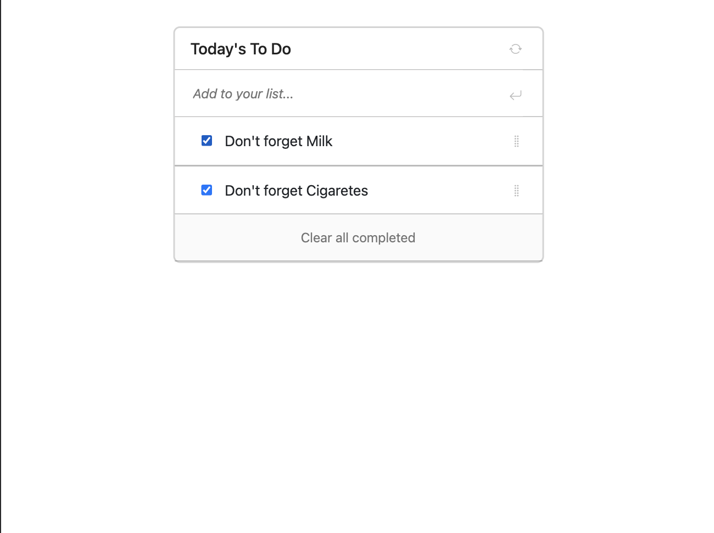

# ToDo 2.0 - To Do List app

> In this project, I will build a simple HTML/JS list of To Do tasks. The list will be styled according to the specifications listed later in this lesson. This simple web page is be built using webpack and served by a webpack dev server.

## Built With

- Java Script
- HTML SCSS
- Webpack & Babel

## Live Demo

[Live Demo Link](https://marijanbrvar.github.io/ToDo-2.0/)

## Getting Started

**When you open the application from the above link, you will be able to add a task to the default job list** immediately
**Otherwise, you can create a new list in the most left input field and add a new task to the current list.**

To get a local copy up and running, follow these simple example steps.

### Prerequisites
- Chrome browser
- Node v14.XX >
- npm (usually already installed with current node version)

### Setup
To run code locally, please follow steps belove
1. `git clone git@github.com:marijanbrvar/Tasker2.0.git && cd Tasker2.0`
2. run `npm install`
3. then run `npm run start`

webpack will automatically open the default browser, and you can start using the ToDo web app. All data is stored locally, which means that all your job/tasks will stay present in the browser after the refresh.

### Usage
1. Add a new Job list by typing the name of the job in the left input field, then press enter or click to add button
2. To enter a new task, which belongs to the currently selected list, click on the new button, then fill n the form.
3. After filling the form, press the "submit" button, and the application will store your task locally.
4. to edit or delete the task, you can find buttons bottom right corner of the task card.

## Authors

👤 MARIJAN BRVAR

- GitHub: [@githubhandle](https://github.com/marijanbrvar)
- Twitter: [@twitterhandle](https://twitter.com/marijanbrvar)
- LinkedIn: [LinkedIn](https://linkedin.com/in/marijanbrvar)

## 🤝 Contributing

Contributions, issues, and feature requests are welcome!

Feel free to check the [issues page](https://github.com/marijanbrvar/ToDo-2.0/issues).

## Show your support

Give a ⭐️ if you like this project!

## 📝 License

This project is [MIT](./LICENSE) licensed.
